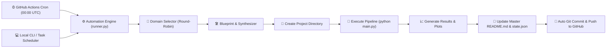

# 🧠 Daily AI, ML, Data Science & Analytics Portfolio

[](projects/)
[](projects/)
[](https://python.org)
[](.github/workflows/daily-project.yml)
[](LICENSE)

> **Autonomous Daily Repository**: Every single day, an automated pipeline designs, tests, builds, and commits a production-ready, self-contained project spanning **Data Science**, **Data Analytics**, **Machine Learning**, **Deep Learning**, **NLP**, and **Artificial Intelligence**.

---

## 📊 Domain Distribution Matrix

|  | **1** projects |
|  | **1** projects |
|  | **0** projects |
|  | **0** projects |
|  | **0** projects |
|  | **0** projects |

---

## 📂 Daily Project Showcase Directory

| Day | Domain | Project & Architecture | Core Tools / Techniques | Status |
| :---: | :---: | :--- | :--- | :---: |
| **Day 002** |  | [SaaS Monthly Cohort Retention & Churn Analytics](https://github.com/abhishektotre/saas-cohort-retention-analytics) | `Data Analytics`, `Cohort Analysis`, `Retention Matrix` | ✅ Completed |
| **Day 001** |  | [Customer Churn Prediction & Retention Analytics](https://github.com/abhishektotre/customer-churn-prediction) | `Data Science`, `EDA`, `Feature Engineering` | ✅ Completed |

---

## 🏗️ Architecture & Automated Execution Flow

The system runs autonomously via **GitHub Actions** (cloud cron) and can also be triggered **locally** via CLI:



Each daily project folder is **100% self-contained** and includes:
- `README.md` (Detailed problem statement, architectural diagram, metrics, and instructions)
- `main.py` (End-to-end runnable entrypoint)
- `src/` (Clean, modular code: data generators, model trainers, evaluation engines)
- `data/` (Synthetic realistic datasets generated on-the-fly)
- `results/` (Generated metric scorecards, confusion matrices, and EDA plots)
- `requirements.txt` (Pinned dependencies)

---

## 🚀 Running Any Project Locally

To run any daily project on your local machine:

```bash
# 1. Clone the repository
git clone <your-repo-url>
cd <repo-folder>

# 2. Enter any day's project folder
cd projects/Day_001_Customer_Churn_Prediction

# 3. Install project dependencies
pip install -r requirements.txt

# 4. Run the end-to-end pipeline
python main.py
```

---

## ⚙️ Triggering the Automation Manually

You can trigger the generator anytime locally:

```bash
# Generate and execute the next daily project
python automation/runner.py --generate --execute

# Generate, execute, and push immediately to GitHub
python automation/runner.py --generate --execute --push

# Check portfolio status and stats
python automation/runner.py --status
```

*Last synchronized: `2026-10-04 18:28:40 UTC`*
